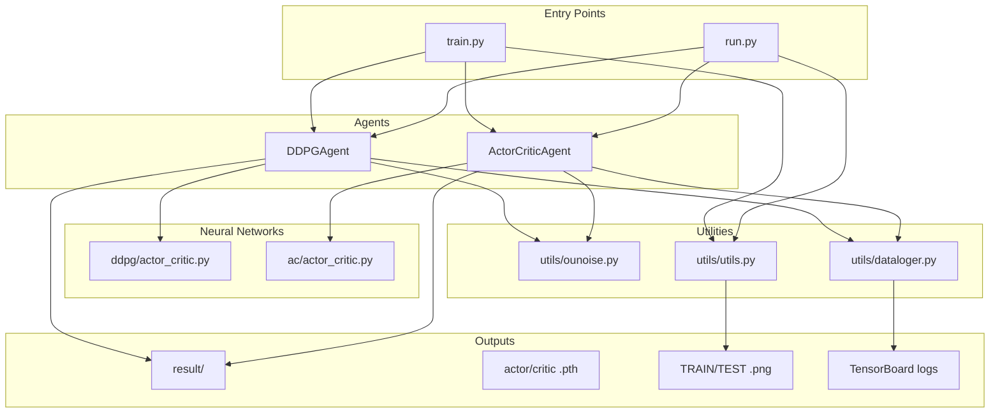

# DDPG & Actor-Critic Project - In-Depth Explanation

This document provides a comprehensive explanation of the codebase for presenting the project to your guide. It covers the project overview, algorithms, file-by-file breakdown, data flow, and suggested presentation order.

---

## 1. Project Overview

### What This Project Does

This repository implements **two reinforcement learning algorithms** for **continuous control**:

1. **DDPG** (Deep Deterministic Policy Gradient) - primary algorithm
2. **AC** (Actor-Critic) - alternative for comparison

Both are **model-free, off-policy** algorithms that learn to control an agent in environments with **continuous action spaces**.

### Environment: MountainCarContinuous-v0

- **Task**: A car sits in a valley and must reach a flag on top of a hill
- **State space**: 2 dimensions (position, velocity)
- **Action space**: 1 dimension (force applied left/right, range [-1, 1])
- **Challenge**: The car has weak power; it must learn to swing back and forth to build momentum
- **Goal**: Reach the flag; score of ~90+ indicates "solved"

### Context

This project is a fork/clone of an open-source DDPG implementation. It has been extended with comprehensive comments and this explanation document for educational and presentation purposes.

---

## 2. High-Level Flow Diagram



---

## 3. Algorithm Explanations

### 3.1 DDPG (Deep Deterministic Policy Gradient)

**Paper**: [Continuous control with deep reinforcement learning](https://arxiv.org/abs/1509.02971)

**Key ideas**:

| Component | Description |
|-----------|-------------|
| **Actor** | Deterministic policy: state → action. Outputs a single action (no sampling). |
| **Critic** | Q-value function: (state, action) → Q(s,a). Estimates expected cumulative reward. |
| **Target networks** | Slow copies of actor and critic. Used for stable Q-learning targets. |
| **Replay buffer** | Stores (s, a, r, s', done). Samples batches for off-policy learning. |
| **OU noise** | Ornstein-Uhlenbeck noise added to actions for exploration. |

**Update equations**:

1. **Critic** (Bellman update):
   ```
   target_Q = r + gamma * Q_target(s', actor_target(s')) * (1 - done)
   critic_loss = MSE(Q(s,a), target_Q)
   ```

2. **Actor** (policy gradient):
   ```
   actor_loss = -Q(s, actor(s))
   ```
   The actor maximizes Q(s, actor(s)), so we minimize its negative.

**Flow**: env → sample_act (actor + OU noise) → step → save_transition → sample_batch → learn (critic + actor update)

---

### 3.2 AC (Actor-Critic)

**Paper**: [Actor-Critic Algorithms](https://papers.nips.cc/paper/1786-actor-critic-algorithms.pdf)

**Key differences from DDPG**:

| Aspect | DDPG | AC |
|--------|------|-----|
| Policy | Deterministic | Stochastic (Normal distribution) |
| Critic | Q(s,a) | V(s) only |
| Advantage | Implicit in Q | TD error = r + gamma*V(s') - V(s) |
| Actor loss | -Q(s, actor(s)) | -log_prob(a) * TD_error |

**Update equations**:

1. **Critic**:
   ```
   target_V = r + gamma * V_target(s') * (1 - done)
   critic_loss = MSE(V(s), target_V)
   ```

2. **Actor** (advantage-weighted policy gradient):
   ```
   TD_error = r + gamma*V(s') - V(s)
   actor_loss = -log_prob(a) * TD_error
   ```

**Note**: AC in this project tends to be less stable and slower to converge than DDPG on MountainCarContinuous. DDPG is the recommended baseline.

---

## 4. File-by-File Breakdown

### 4.1 train.py

**Purpose**: Main training script. Runs the training loop for 1000 episodes.

**Flow**:
1. Create MountainCarContinuous-v0 environment
2. Initialize agent (DDPG or AC based on `agent_name`)
3. For each episode: sample_act → step → save_transition → learn
4. Save model when avg_score >= 80
5. Plot training curves via `utils.utils.plt_graph`

**Key variables**: `exp_name`, `agent_name` (DDPG or AC), `episodes = 1000`

---

### 4.2 run.py

**Purpose**: Evaluate a trained model. Loads weights and runs 100 test episodes.

**Key differences from train.py**:
- Uses `agent.predict()` (no exploration noise) instead of `agent.sample_act()`
- Loads model via `agent.load_model(actor_path, critic_path)`
- Runs 100 episodes (vs 1000)
- Tracks steps and force for efficiency metrics

**Before running**: Update `load_model()` paths to your trained checkpoint.

---

### 4.3 ddpg/actor_critic.py

**Purpose**: Neural network definitions for DDPG.

**Classes**:
- **DDPGActor**: state → action. MLP with Tanh output (action in [-1, 1])
- **DDPGCritic**: (state, action) → Q(s,a). Two streams (state + action) combined before output

**Architecture**: state(2) → hidden1(256) → hidden2(256) → output

---

### 4.4 ddpg/ddpg_agent.py

**Purpose**: DDPG algorithm implementation. Manages training, replay buffer, and exploration.

**Key methods**:
- `sample_act(state)`: actor output + OU noise (for training)
- `predict(state)`: actor output only (for evaluation)
- `save_transition(s,a,r,s',done)`: store in replay buffer
- `learn(epoch, step, cur_state)`: update critic and actor
- `save_model` / `load_model`: persist weights

**Dependencies**: utils.ounoise, utils.dataloger, ddpg.actor_critic

---

### 4.5 ac/actor_critic.py

**Purpose**: Neural network definitions for AC.

**Classes**:
- **Actor**: state → Normal(mu, sigma). Stochastic policy; sample action from distribution
- **Critic**: state → V(s). State value, not Q(s,a)
- **ActorCritic**: Combined module (shared backbone). Not used by ac_agent; ac_agent uses separate Actor and Critic.

---

### 4.6 ac/ac_agent.py

**Purpose**: Actor-Critic algorithm implementation.

**Key differences from DDPGAgent**:
- Actor returns distribution; action sampled via `dist.sample()`
- Critic outputs V(s); TD_error used as advantage
- Actor loss: -log_prob(a) * TD_error
- Gradient clipping on actor (max_norm=3)

---

### 4.7 utils/dataloger.py

**Purpose**: TensorBoard logging. Wraps `SummaryWriter`.

**Usage**: `loger.log('actor_loss', value, step)`  
**View**: `tensorboard --logdir=./result/ddpg/exp1`

---

### 4.8 utils/ounoise.py

**Purpose**: Ornstein-Uhlenbeck noise for exploration.

**Formula**: dx = theta*(mu - x) + sigma*randn; x = x + dx  
**Why**: Temporally correlated noise; better for physical control than white noise.

---

### 4.9 utils/utils.py

**Purpose**: Plotting training/evaluation curves.

**Function**: `plt_graph(episodes, scores, avg_scores, goals, env_name, model_name, exp_name, save_path)`  
**Output**: PNG with Score, Average Score, Solved Requirement (90) lines.

---

## 5. Data Flow

### 5.1 Experience Flow (Training)

```
env.step(action) → (s', r, done, ...)
        ↓
agent.save_transition(s, a, r, s', done)
        ↓
replay buffer (circular, max buf_size)
        ↓
agent.sample_batch() → (s, a, r, s', done) batch
        ↓
agent.learn() → update critic, update actor
```

### 5.2 Model Save/Load Paths

| Agent | Models | Plots | TensorBoard |
|-------|--------|-------|-------------|
| DDPG | result/ddpg/{exp_name}/actor_epoch*_avgScore*.pth | result/{agent_name}/{exp_name}/ | result/ddpg/{exp_name}/ |
| AC   | result/ac/{exp_name}/actor_epoch*_avgScore*.pth  | result/{agent_name}/{exp_name}/ | result/ac/{exp_name}/ |

**Note**: `agent_name` in train.py is "DDPG" (uppercase), so plots go to `result/DDPG/exp2/`. Models use lowercase `result/ddpg/`.

---

## 6. Presentation Order Suggestion

Use this order when explaining the project to your guide:

1. **Project overview** (Section 1)
   - What: DDPG and AC for continuous control
   - Where: MountainCarContinuous-v0
   - Why: Learn to drive car to hilltop

2. **train.py**
   - Entry point, training loop
   - Agent selection (DDPG vs AC)
   - Episode flow: sample_act → step → save_transition → learn

3. **ddpg/actor_critic.py**
   - DDPGActor: deterministic policy
   - DDPGCritic: Q(s,a) network
   - Architecture and dimensions

4. **ddpg/ddpg_agent.py**
   - DDPG algorithm core
   - learn(): Bellman update for critic, policy gradient for actor
   - Replay buffer, target networks
   - sample_act vs predict

5. **utils/**
   - ounoise: OU process for exploration
   - dataloger: TensorBoard logging
   - utils: plotting

6. **run.py**
   - Evaluation flow
   - Load model, predict (no noise), test episodes

7. **ac/** (comparison)
   - Differences from DDPG: stochastic policy, V(s) critic
   - TD error as advantage

8. **result/**
   - Saved models (.pth)
   - Training/test plots (.png)
   - TensorBoard event files

---

## 7. Quick Reference: Key Formulas

### DDPG
- **Critic**: target_Q = r + γ·Q_target(s', μ_target(s')); MSE(Q, target_Q)
- **Actor**: loss = -Q(s, μ(s))

### AC
- **Critic**: target_V = r + γ·V_target(s'); MSE(V(s), target_V)
- **TD error**: δ = r + γ·V(s') - V(s)
- **Actor**: loss = -log π(a|s) · δ

---

## 8. Running the Project

```bash
# Install dependencies
pip install -r requirements.txt

# Train (saves to result/ddpg/exp2 or result/ac/exp2)
python train.py

# Run/evaluate (update model paths in run.py first)
python run.py

# View TensorBoard
tensorboard --logdir=./result/ddpg/exp1
```
